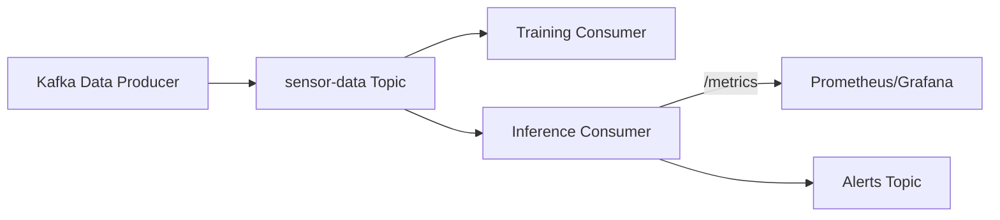

# Sensor Anomaly Detection with LSTM Autoencoder, Kafka, Prometheus, and Grafana

This project implements a real-time anomaly detection system for IoT sensor data using **Kafka**, **Faust**, **PyTorch (LSTM Autoencoder)**, and a monitoring stack with **Prometheus + Grafana**.

## 🚀 Features
- **Kafka + Faust** for real-time data streaming and processing.
- **PyTorch LSTM Autoencoder** for anomaly detection on sensor time series.
- **Prometheus** for metrics collection and monitoring.
- **Grafana** dashboards for real-time visualization and alerts.
- **AlertManager** integration for anomaly alerting.

## 🛠️ Project Structure
```
.
├── docker-compose.yml          # Docker services (Kafka, Prometheus, Grafana, etc.)
├── prometheus.yml              # Prometheus scrape configuration
├── alertmanager.yml            # Alertmanager config
├── model/                      # Trained PyTorch models
├── inference_consumer.py       # Faust app for real-time inference
├── training_consumer.py        # Faust app for start training
├── train_model.py              # Training script for LSTM Autoencoder
├── load_model.py               # Model loading helper
├── fake_data_producer.py       # Create fake IoT sensor data
├── requirements.txt            # Python dependencies for the project
└── README.md                   # Project documentation

```

## 📦 Prerequisites
- Docker & Docker Compose
- Python 3.7 with PyTorch installed
- Kafka client libraries
- Faust
- PyTorch
- Kafka
- Prometheus Client

- Install Python dependencies:
```bash
pip install -r requirements.txt
```

## ▶️ Running the Project

### 1. Start the monitoring + Kafka stack
```bash
docker-compose up -d
```
### 2. Produce sensor data into Kafka
```bash
python fake_data_producer.py
```

### 3. Train the model
```bash
faust -A training_consumer worker -l info
```

### 4. Start the Faust inference consumer
```bash
faust -A inference_consumer worker -l info
```

### 5. Access services
- **Prometheus** → [http://localhost:9090](http://localhost:9090)
- **Grafana** → [http://localhost:3000](http://localhost:3000) (default user: `admin`, password: `1379`)
- **Alertmanager** → [http://localhost:9093](http://localhost:9093)

## 📊 Grafana Integration
- Prometheus metrics are scraped from:
  - Faust app (`/metrics` endpoint on port `8000`)
  - Node Exporter (`:9100`)
  - cAdvisor (`:8080`)
- Dashboards can be imported from Grafana marketplace or created manually.

## 🔄 Data Flow


## ⚠️ Alerts
Alert rules can be configured in `prometheus.yml` and routed via `alertmanager.yml`.

## 📝 Notes
- Ensure containers are in the same Docker network for Prometheus to reach services.
- Adjust `prometheus.yml` targets depending on whether services run inside Docker or on host.
- The window size (WINDOW_SIZE) and step (STEP) can be configured in training_consumer.py.
- After training is complete, the model files should be saved for use during inference.
- Missing model alerts can be received through the `alerts` topic.
- If needed, the sensor data distribution can be modified in `fake_data_producer.py`.
---

💡 With this setup, you have a **real-time anomaly detection pipeline** fully observable with **Prometheus + Grafana**.
